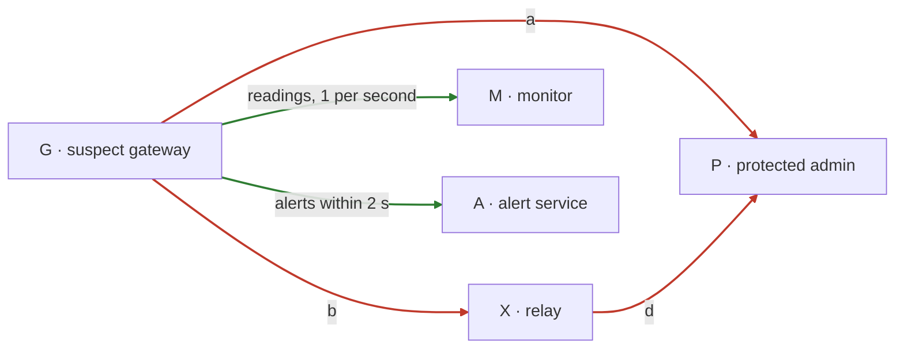
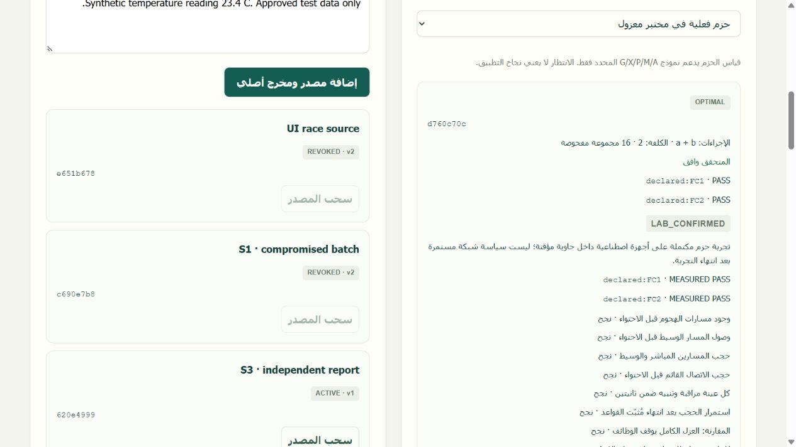
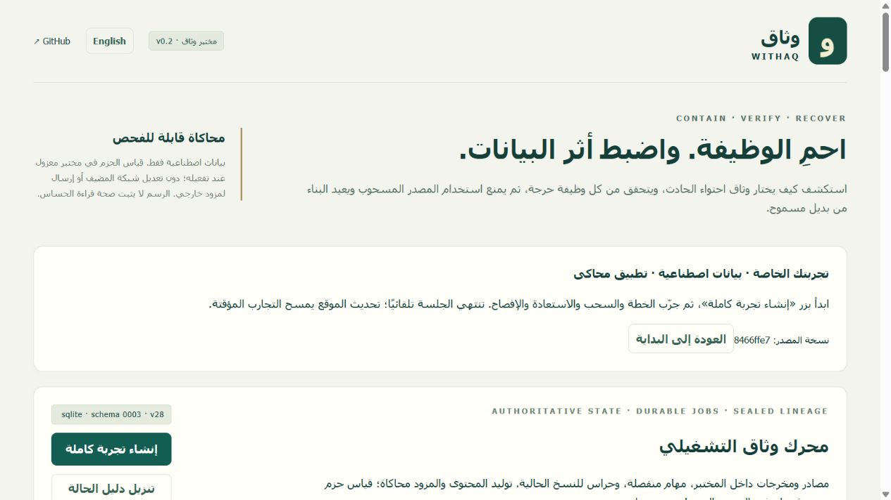
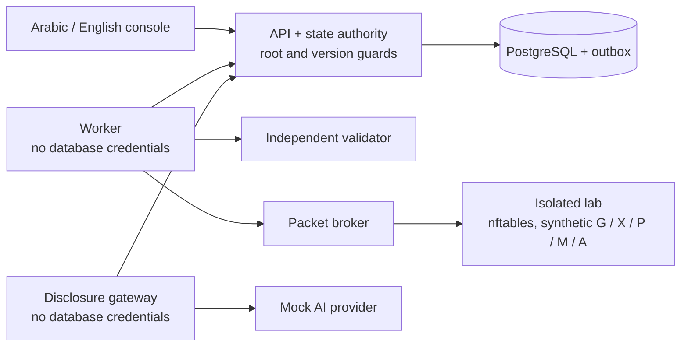

# WITHAQ | وثاق

**Contain the suspect device. Keep the critical function running. Control where its data goes.**

**«نحتوي الخطر ونحافظ على العمل»**

WITHAQ is a governed containment and data-lifecycle control system that combines bounded security planning, independent validation, immutable lineage, revocation barriers, controlled disclosure, and isolated enforcement experiments.

وثاق هو نظام تجريبي للتحكم الآمن في الاحتواء ودورة حياة البيانات، يجمع بين التخطيط المحدود لإجراءات الحماية، والتحقق المستقل، وتتبع مصدر البيانات، وسحب الصلاحيات، والتحكم في الإفصاح، واختبارات التنفيذ المعزولة.

**SAIF 2026** · Track: **Cybersecurity & Defense Technologies**

<div align="center">
  <a href="https://withaq-demo.onrender.com/">
    
  </a>
</div>

Live browser demo: no installation, no account, synthetic data, a private temporary workspace per visitor.


---

## باختصار

عندما يُشتبه في وجود جهاز متصل بالشبكة، مثل **بوابة تقوم بتمرير بيانات المراقبة والقياسات من الأجهزة إلى السيرفر**، تكون خيارات الاحتواء التقليدية غالبًا غير كافية:

- **عزله بالكامل:** يتوقف الهجوم، وتتوقف معه المراقبة والتنبيهات الحرجة التي تعتمد عليه.
- **تركه يعمل:** تستمر الوظائف الحرجة، ويستمر الخطر معها.
- **حذف بياناته:** يختفي الملف الأصلي، لكن التقارير والملخصات وطلبات الذكاء الاصطناعي المبنية عليه تبقى مستخدمة، ويمكن أن تُرسل إلى خدمة ذكاء اصطناعي خارجية.

وثاق استجابة واحدة قابلة للتحقق على ثلاث طبقات:

- **احتواء يحافظ على الوظيفة:** يختار أقل مجموعة حجب تقطع كل مسار هجوم مُنمذج، بشرط أن تبقى كل وظيفة حرجة ضمن حدودها. يعيد متحقق مستقل فحص الخطة قبل تطبيقها، وتُقاس كل وظيفة بعده. وإذا لم يوجد حل آمن يعلن ذلك صراحة بدل ادعاء النجاح.
- **ضبط الإفصاح للذكاء الاصطناعي:** قبل أن تخرج أي بيانات إلى مزود ذكاء اصطناعي، يفحص البايتات نفسها والوجهة والحساب والغرض، فيسمح أو ينقّح أو يحجب أو يطلب اعتمادًا بشريًا مربوطًا بتلك البايتات بالضبط.
- **سحب المصدر وإعادة البناء:** عند سحب مصدر مشبوه يُمنع كل ما اشتُق منه من القراءة والنشر والإرسال لحظة اعتماد السحب، حتى نتيجة نموذج تصل متأخرة. تستمر المخرجات المستقلة، ويُعاد بناء المتأثر من مصدر بديل معتمد بهوية جديدة.

الإصدار 0.2.0 مختبر هندسي يعمل على أجهزة وبيانات وهمية: قياس حزم فعلي بـ nftables داخل حاوية معزولة، وPostgreSQL مرجعًا للحالة، ومزود ذكاء اصطناعي وهمي (mock) لا يخرج منه أي بايت. [جرّب العرض المباشر](https://withaq-demo.onrender.com/).

---

## The problem

A connected device, for example a gateway relaying monitoring readings, starts behaving suspiciously. The usual responses are blunt:

- **Isolate it completely.** The attack stops, and so do the monitoring and alerts that depend on it.
- **Leave it running.** Critical functions continue, and so does the risk.
- **Delete its data.** The original file is gone, but the reports, summaries and AI prompts built from it are still in use, and can still be sent to an external AI service.

## The idea

WITHAQ handles this as one response with three enforcement points, each producing its own evidence.

| Layer | The question it answers | What WITHAQ does |
|---|---|---|
| **Function-safe containment (MFSC)** | Which connections can we cut without breaking anything critical? | Searches a bounded set of deny actions for the cheapest plan that blocks every modeled attack path **and** keeps every critical function within its contract. A separate validator rechecks the plan before enforcement; each function is measured afterwards. |
| **AI disclosure guard** | May these exact bytes go to this destination, account and purpose, now? | Inspects the complete request locally and decides `ALLOW`, `SANITIZE`, `BLOCK` or `REQUIRE_APPROVAL`. An approval is bound to the hash of the exact bytes: change one byte and it no longer applies. |
| **MAHW: revocation and recovery** | A source is tainted. What else must stop, and what may continue? | Revoking a source blocks every derivative at read, publication and dispatch from the moment the revocation commits, including AI results that arrive late. Independent outputs keep working; affected ones are rebuilt from an approved alternative under a new identity. |

Two rules hold everywhere: **every critical function must pass on its own** (an average cannot hide a missed alert), and **missing evidence is reported as `UNKNOWN`**, never as success. No language model authorizes a security decision.

## One scenario, end to end



Gateway **G** feeds a monitor **M** and an alert service **A** (green: critical functions). If G is compromised, it could reach a protected admin service **P** directly or through relay **X** (red: attack paths). Action **c** would isolate G completely.

| Plan | Cost | Attack paths blocked | Critical functions kept | Verdict |
|---|---:|:---:|:---:|---|
| `{a}` block G→P | 1 | 1 of 2 | 2 of 2 | Rejected: relay path still open |
| `{c}` isolate G | 1 | 2 of 2 | 0 of 2 | Rejected: monitoring and alerts stop |
| **`{a, b}` block G→P and G→X** | **2** | **2 of 2** | **2 of 2** | **Chosen** |
| `{a, d}` block G→P and X→P | 3 | 2 of 2 | 2 of 2 | Valid, but costs more |

Of all 16 possible combinations, three are safe and `{a, b}` is the cheapest. In the isolated lab WITHAQ applies it as real nftables rules and measures the result: the direct path, the relay path and an already-open TCP session are blocked, while every monitored reading and alert still arrives within 2 seconds.

The data side of the same incident:

1. Batch **S1** from the suspect gateway is revoked. Outputs **T1** and **T2** that depend on it are blocked at once. An AI summary still being generated from S1 is rejected when it returns.
2. Output **T3**, built only from an independent source **S3**, stays available. An artifact whose lineage cannot be proven is **held** for review, not deleted.
3. **T2** is rebuilt as a new output **T2b** from the approved source **S2**. S1 stays revoked.
4. A request containing a password is **blocked**; one containing an email address is **sanitized** and inspected again; an approved request is dispatched through the gateway to a mock provider, so zero bytes leave the machine.

## Why not a simpler approach?

A model-only comparison covers 6 scenario families × 10 seeds × 5 policies = 300 settings. The same independent validator judges every proposed plan.

| Policy | Safe plans (of 60) | What happened in the other settings |
|---|:---:|---|
| Full quarantine | 0 | Always stops the attack, and always breaks monitoring and alerts |
| Risk-based "block the most" | 0 | Ignores function contracts; same failures |
| Static segmentation | 30 | 30 plans rejected: they break a declared critical function or rely on missing evidence |
| Function-aware greedy | 30 | 30 `UNKNOWN`: it cannot tell "impossible" from "not found" |
| **WITHAQ MFSC** | **30, all optimal within the model** | **20 proven `INFEASIBLE`, 10 `UNKNOWN` because evidence was missing; no unsafe plan proposed** |

Where another policy also found a safe plan, MFSC's plan was never more expensive, and was cheaper in 4 of 30 settings against static segmentation and 2 of 30 against greedy. The larger difference is what happens when no safe plan exists: WITHAQ proves it, instead of proposing a plan that quietly breaks a critical function. Baselines are project-defined heuristics, not commercial products. Raw results: [benchmark-v0.2.csv](docs/evidence/benchmark-v0.2.csv).

## What is built and verified (release 0.2.0)

| Capability | How it is verified |
|---|---|
| MFSC planner and independent validator | Validator runs as a separate service and shares only data schemas with the planner. The 16-subset oracle passes; tampered, stale and unsafe plans are rejected. |
| Real packet enforcement | nftables inside a network-less Docker container. Direct, relay and established-session traffic is blocked; five samples are measured per critical function; a signed receipt is bound to the plan and snapshot hashes. |
| Authoritative state | PostgreSQL with three Alembic migrations, versions, idempotency keys and roles; revocation and its job event commit in one transaction. |
| Lineage, revocation and recovery | Sealed input manifests, transitive roots and cycle rejection; guards at read, publication and dispatch; late results rejected; rebuilds get a new identity. |
| Crash safety | A worker is killed mid-job and restarted: the job resumes with a higher fencing token, produces one output and revives nothing. |
| AI disclosure gateway | Arabic and English inspection, four decisions, exact-byte approval. A lost provider response becomes `OUTCOME_UNKNOWN`, never a blind resend. |
| Backup restore | An older PostgreSQL dump plus a newer signed revocation ledger is applied before jobs resume (seven checks pass). |
| Bilingual console | Arabic and English views of plans, contracts, lineage, disclosure and JSON evidence export. |



### How to read the result labels

| Label | Meaning |
|---|---|
| `OPTIMAL` | The search finished over the declared finite model, and this is the cheapest safe plan within it. |
| `INFEASIBLE` | The search finished and no plan satisfies every hard constraint. |
| `UNKNOWN` | Evidence is missing or the search timed out: neither safe nor impossible. |
| `LAB_CONFIRMED` | A completed packet trial on synthetic devices in a temporary container, with each critical function measured. |
| `SIMULATED_CONFIRMED` | Enforcement was simulated, as in the public demo. |
| `MOCK_SENT` | Dispatch went to a local mock provider; no bytes left the machine. |

## Try it

### In the browser

Open the [live demo](https://withaq-demo.onrender.com/), choose **Try WITHAQ (جرّب وثاق)**, then **Create full experiment (إنشاء تجربة كاملة)**. Plan the incident, revoke S1, rebuild T2 from S2 and try a disclosure request. The step-by-step judge script is in [docs/JUDGES.md](docs/JUDGES.md).

The public demo uses simulated enforcement and synthetic data; real packet measurements run only in the local lab below. It is hosted on a free plan, so the first load after a period of inactivity can be slow. Limits and isolation are described in [docs/DEPLOYMENT.md](docs/DEPLOYMENT.md).



### On your machine (Windows)

Requires Python 3.12+ and Node 22.12+ (the team uses Node 24 LTS). Docker Desktop is needed for PostgreSQL and the isolated packet lab.

```powershell
git clone https://github.com/whyKaiser/withaq.git
cd withaq
powershell -File scripts/bootstrap.ps1
.\.venv\Scripts\python.exe scripts/init_lab.py
docker compose -f compose.dev.yml up -d --wait db
.\.venv\Scripts\python.exe scripts/lab.py --postgres --packets
```

Open **http://127.0.0.1:8000** and paste the operator token from `data/local-access.txt`. The token stays in page memory only. `data/local-credentials.json` holds a read-only viewer token and separate service credentials; never publish `data/`.

- **Linux/macOS:** run `bash scripts/bootstrap.sh`, use `.venv/bin/python`, and the same Docker and launcher commands. This release was verified on Windows with Docker's Linux engine; a separate Linux/macOS bootstrap check is still pending.
- **Without Docker:** `.venv\Scripts\python.exe scripts/lab.py` starts four services with SQLite and simulated enforcement. The packet lab is unavailable in this mode. `scripts/serve.py` is a compatibility alias.
- **Stopping:** Ctrl+C stops the services. PostgreSQL keeps running; stop it with `docker compose -f compose.dev.yml stop`. Avoid `down -v`, which deletes the database volume. Restarting preserves roots, barriers, jobs and audit records.

### Verify the claims

```powershell
.\.venv\Scripts\python.exe -m pytest
.\.venv\Scripts\python.exe scripts/verify_postgres.py
npm.cmd --prefix apps/console run build
.\.venv\Scripts\python.exe scripts/packet_lab.py
.\.venv\Scripts\python.exe scripts/benchmark.py
.\.venv\Scripts\python.exe scripts/restore_qualification.py
```

Latest recorded run: 84 tests passed on Windows with PostgreSQL and 68 inside the Linux deployment image; the TypeScript/Vite build passed ([handoff](vault/08-HANDOFF.md)). Generated results go to the ignored `artifacts/` folder; the published bundles in [docs/evidence](docs/evidence/README.md) record their source commit. GitHub Actions is not active yet because the current connection lacks the `workflow` permission; the ready configuration is in [docs/ci](docs/ci/github-actions.yml).

## Architecture



Device traffic crosses the network enforcement point, reads and publication cross the API's root guards, and anything leaving for an AI provider crosses the disclosure gateway. The three share incident and policy versions but keep separate evidence.

## Technology stack

WITHAQ uses a Python backend, a TypeScript web console, and an isolated Linux-based lab for validating enforcement behavior.

| Area | Technologies | Purpose |
|---|---|---|
| Backend API and services | **Python, FastAPI** | Exposes the API and coordinates system services and security workflows. |
| Data access and schema migrations | **SQLAlchemy, Alembic** | Database models, persistence, and versioned schema migrations. |
| Primary database | **PostgreSQL** | Authoritative state, versions, roles, idempotency keys, and transactional revocation events. |
| Lightweight local mode | **SQLite** | Fallback for running the lab without Docker; packet enforcement is simulated in this mode. |
| Web console | **React, TypeScript, Vite** | Arabic/English operator interface and frontend build tooling. |
| Containerized lab | **Docker** | Isolates the packet-enforcement experiment from the host environment. |
| Network enforcement | **Linux network namespaces, nftables** | Provides an isolated network environment and applies/measures packet-filtering rules in the local lab. |
| Testing and verification | **pytest, project verification scripts, npm build** | Tests backend behavior, verifies database and recovery properties, checks packet trials, runs benchmarks, and builds the console. |
| AI disclosure testing | **Disclosure gateway, local mock AI provider** | Checks requests before dispatch; the mock provider is used for controlled tests, so no request bytes are sent to an external AI provider. |

### Runtime modes

- **Full local lab:** PostgreSQL plus Docker-based packet enforcement and measured `nftables` rules.
- **Without Docker:** SQLite with simulated enforcement; real packet-lab measurements are unavailable.
- **Public browser demo:** Synthetic data and simulated enforcement. It does not perform the local lab's real packet measurements.

The mock AI provider is a test component, not a production LLM integration.


## Documentation

- [Judges: run the complete demonstration](docs/JUDGES.md)
- [Public demo deployment and automatic updates](docs/DEPLOYMENT.md)
- [Poster-to-code traceability and limits](docs/POSTER-TRACEABILITY.md) · [Acceptance mapping](docs/acceptance.md)
- [Raw verification evidence](docs/evidence/README.md)
- [Team vault](vault/00-START-HERE.md) · [Current status](vault/02-STATUS.md) · [Sprints](vault/sprints/README.md) · [Phases](vault/05-PHASES.md)
- [English engineering guide](vault/references/WITHAQ_Complete_Build_Operations_EN.pdf) · [Arabic engineering guide](vault/references/WITHAQ_Complete_Build_Operations_AR.pdf)
- [Submitted poster](docs/WITHAQ_SAIF_2026_Poster_SUBMISSION.pdf)

## Team

WITHAQ is built by six independent Saudi graduates for SAIF 2026 (Cybersecurity & Defense Technologies track), with no external funding or institutional support:

- **Ahmed Kamal Alshareef**, team lead
- Abdulrahim Rashid Alharbi
- Hussain Emad Mash
- Yazan Alhusseini
- Faris Mohammed Alsulami
- Osamah Saeed Alharbi
