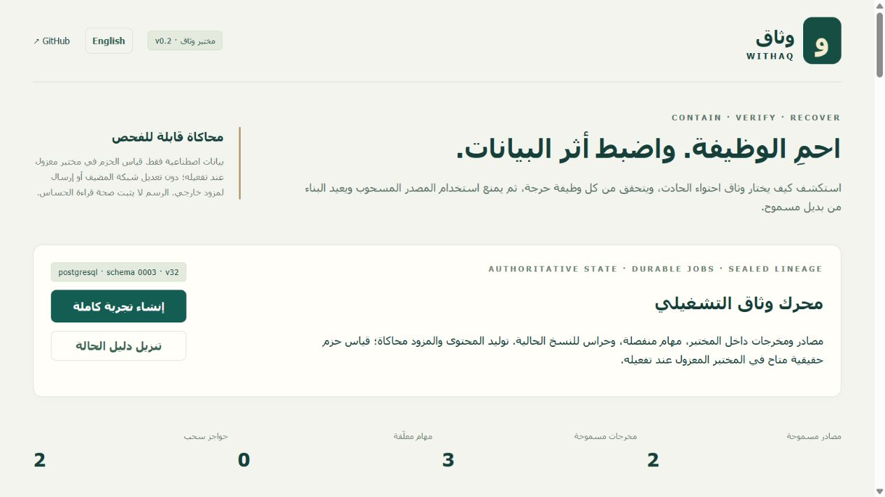

# WITHAQ | وثاق

**Function-safe containment, governed disclosure, revocation and independent recovery.**

وثاق مشروع فريق سعودي من ستة خريجين لمسابقة سيف 2026. نسخة **0.2.0** تشغّل رحلة مختبر كاملة: خطة ومتحقق مستقل، تطبيق مع قياسات حزم داخل مختبر معزول، مصادر ومخرجات عامة، سحب أثناء التوليد، استعادة بهوية جديدة، وفحص إفصاح واعتماد دقيق.

**Engineering lab, synthetic devices and data.** PostgreSQL is authoritative in the qualified setup. The content provider and external dispatch adapter are mock: no paid key or external data transmission. Real TCP/nftables measurements run in disposable containers and bind to the selected plan. They do not establish production IoT coverage or persistent protection after a trial ends.

- [Judges: run the complete demonstration](docs/JUDGES.md)
- [Poster-to-code traceability and limits](docs/POSTER-TRACEABILITY.md)
- [Raw verification evidence](docs/evidence/README.md)
- [Team vault](vault/00-START-HERE.md) · [Current status](vault/02-STATUS.md)
- [Sprints](vault/sprints/README.md) · [Phases](vault/05-PHASES.md)
- [Arabic engineering guide](vault/references/WITHAQ_Complete_Build_Operations_AR.pdf) · [English guide](vault/references/WITHAQ_Complete_Build_Operations_EN.pdf)
- [Submitted poster](docs/WITHAQ_SAIF_2026_Poster_SUBMISSION.pdf)

## Start on Windows

Python 3.12+, compatible Node 22.12+ (team recommendation: Node 24 LTS). Docker Desktop is required for PostgreSQL and isolated packet trials; the fallback runs without Docker.

```powershell
git clone https://github.com/whyKaiser/withaq.git
cd withaq
powershell -File scripts/bootstrap.ps1
.\.venv\Scripts\python.exe scripts/init_lab.py
docker compose -f compose.dev.yml up -d --wait db
.\.venv\Scripts\python.exe scripts/lab.py --postgres --packets
```

Open **http://127.0.0.1:8000**. Copy the generated token from `data/local-access.txt`. It stays in page memory. `data/local-credentials.json` contains a read-only viewer token and separate service credentials; never publish `data/`.

Linux/macOS: use `bash scripts/bootstrap.sh`, replace the Python executable with `.venv/bin/python`, and use the same Docker/launcher commands. This release was verified on Windows with Docker's Linux engine; independent Linux/macOS bootstrap remains a team check.

Without Docker: `.venv\Scripts\python.exe scripts/lab.py` starts four services with SQLite and simulated enforcement. `scripts/serve.py` is a compatibility alias. The packet adapter is unavailable in this mode.

Ctrl+C stops the child services. PostgreSQL remains running; stop it with `docker compose -f compose.dev.yml stop`. Avoid `down -v`: it removes the database volume. Restarting preserves roots, barriers, jobs and audit records. An expired admitted send becomes `OUTCOME_UNKNOWN`, never an automatic resend.

## Implemented

- Bounded MFSC search, up to 12 actions, four solver outcomes and a separately running independent validator. The 16-subset example has exactly three feasible subsets and selects `{a,b}`.
- PostgreSQL/SQLAlchemy with three real Alembic migrations; transactional versions and idempotency, roles, atomic revoke/outbox, leased jobs, heartbeats and fencing.
- General immutable artifacts, transitive root closure, acyclic lineage, complete source/system/history/tool manifests, guards at read and publication, new-identity independent recovery.
- Arabic/English deterministic disclosure corpus; `ALLOW`, `SANITIZE`, `BLOCK`, `REQUIRE_APPROVAL`. Sanitization preserves lineage and reinspects exact bytes. Approval binds bytes, destination, account, purpose, policy, roots and expiry.
- Separate HTTP-only worker and gateway without DB credentials. Frozen `ADMITTED` precedes the mock adapter; lost outcomes prevent blind retry.
- Optional packet broker: G/X/P/M/A synthetic endpoints, nftables denies before established-flow acceptance, new/existing TCP tests, individual monitor/alert observations. Signed receipts are independently checked by the API. Packet support is deliberately limited to this mapped topology.
- A 300-setting **model-only** comparison with seeds, complete snapshots, invalid/unknown outcomes and raw results. Baselines are explicit project heuristics, not commercial product evaluations.
- An executed PostgreSQL restore qualification using an old backup plus a newer authenticated revocation ledger before job resume.

## Verify

```powershell
.\.venv\Scripts\python.exe -m pytest
.\.venv\Scripts\python.exe scripts/verify_postgres.py
npm.cmd --prefix apps/console run build
.\.venv\Scripts\python.exe scripts/packet_lab.py
.\.venv\Scripts\python.exe scripts/benchmark.py
.\.venv\Scripts\python.exe scripts/restore_qualification.py
```

Generated results stay in ignored `artifacts/`. Public evidence is intentionally selected from synthetic trials. Read its source commit and working-tree marker; do not treat old 0.1 evidence as proof of new features.

GitHub Actions is **not active**: the existing OAuth connection lacks `workflow` scope. [Ready configuration](docs/ci/github-actions.yml) remains outside the workflow directory. Local checks are not a GitHub Actions run.

## Boundaries and team workflow

The 62-page guide also describes institutional identities, production separation and network egress controls, object storage, source attribution windows, general AND/OR dependency management, real devices and broader qualification. Those are still open. The current workspace transaction lock favors correctness over write throughput. The latest trusted ledger must be selected by an operator; off-host ledger replication/freshness authority is not implemented. Disclosure rules are bounded synthetic checks, not universal DLP.

GitHub hosts the source and evidence; it does not host the authenticated runtime. [Read the vault](vault/00-START-HERE.md), claim a card, branch from current main, update status and tests, then request review by another teammate. Human review, another member's reproduction and the team's license decision remain pending.


