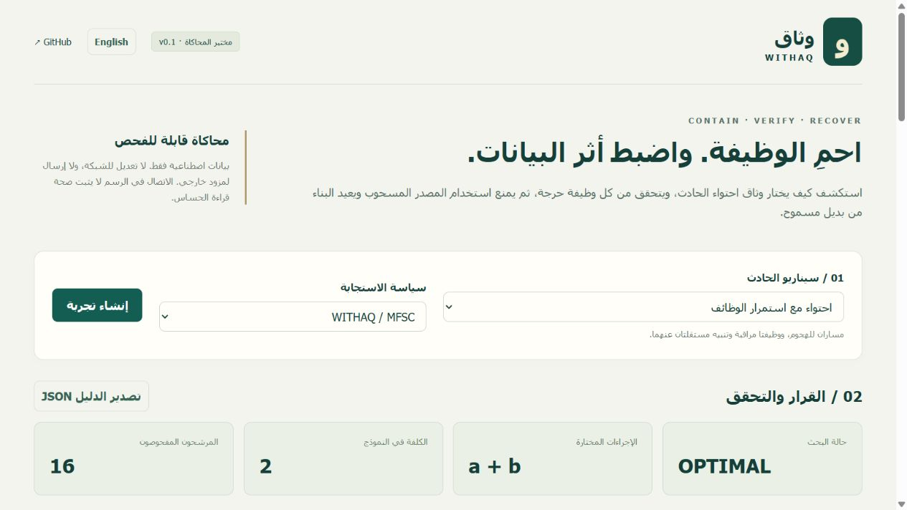

# WITHAQ | وثاق

**Function-aware containment, governed disclosure, and source revocation with recovery.**

نموذج تجريبي لفريق وثاق في مسابقة سيف 2026. يتضمن محرك احتواء محدودًا، متحققًا مستقلًا، محاكاة سحب صلاحية البيانات وإعادة البناء، وبوابة إفصاح محاكية مع لوحة عربية/إنجليزية.

**Current release: local simulation, synthetic data only.** No real network rules are installed and no external AI service receives data. This repository does **not** yet implement the entire 62-page engineering blueprint. See the [verified status](vault/02-STATUS.md) and [acceptance mapping](docs/acceptance.md).

- **Team starting point:** [vault/00-START-HERE.md](vault/00-START-HERE.md)
- **Judges:** [five-minute demonstration](docs/JUDGES.md)
- **Plan through 8 October 2026:** [sprints](vault/sprints/README.md) · [phases](vault/05-PHASES.md)
- **Design sources:** [Arabic](vault/references/WITHAQ_Complete_Build_Operations_AR.pdf) · [English](vault/references/WITHAQ_Complete_Build_Operations_EN.pdf)
- **Submitted poster:** [PDF](docs/WITHAQ_SAIF_2026_Poster_SUBMISSION.pdf)

## Run locally

Requirements: Python 3.12+ and a Node version supported by Vite 8 (Node 22.12+ or a compatible newer version). Use Node 24 LTS for the team baseline. No API key, GPU, physical device, Docker, or paid subscription is required for this simulation.

### Windows PowerShell

```powershell
git clone https://github.com/whyKaiser/withaq.git
cd withaq
powershell -File scripts/bootstrap.ps1
.\.venv\Scripts\python.exe scripts/serve.py
```

### Linux / macOS

```bash
git clone https://github.com/whyKaiser/withaq.git
cd withaq
bash scripts/bootstrap.sh
.venv/bin/python scripts/serve.py
```

Open **http://127.0.0.1:8000**. Copy the local operator token from `data/local-access.txt` into the login field. It is generated on your computer, never committed, and retained only in browser memory. A read-only viewer token is in `data/local-credentials.json`. Bind only to loopback; this local development identity scheme is not a public deployment identity system.

First-time bootstrap downloads dependencies. After installation, the demo runs without an external model or font service. GitHub links need internet access. Stop using Ctrl+C; restart preserves the SQLite demo state. Do not publish the `data` directory.

## What works now

1. Six deterministic scenarios: separable containment, inseparable critical channel, bounded extra dependency, incomplete evidence, late alert, and unavailable enforcement action.
2. Bounded exhaustive MFSC search with explicit `OPTIMAL`, `FEASIBLE`, `INFEASIBLE`, `UNKNOWN` outcomes. Minimum is relative to the declared finite model, not a global theorem.
3. Independent validator using transitive closure, rechecking versions, action support, reachability and each critical contract. Full quarantine and single-path blocking are comparison candidates; rejected candidates cannot be applied.
4. Persistent synthetic S1/S2/S3 and T1/T2/T3/C-D fixture. Revocation blocks new dependent reads and late publication admission, preserves the independent branch, and allows a new T2b from S2.
5. Disclosure inspection, exact-request approval, current-root recheck, and simulated sent/unknown outcomes without blind retries.
6. Arabic/English console, JSON evidence export, local role checks, transactional version checks and idempotency.

## Verification

```powershell
.\.venv\Scripts\python.exe -m pytest
.\.venv\Scripts\python.exe scripts/export_evidence.py
npm.cmd --prefix apps/console run build
```

Equivalent Python commands use `.venv/bin/python` on Linux/macOS. Generated evidence is written to `artifacts/` and is not committed automatically. Committed sample evidence contains synthetic values only.

GitHub Actions is **not active yet**: the current GitHub connection lacks the `workflow` scope. The ready-to-enable configuration is [docs/ci/github-actions.yml](docs/ci/github-actions.yml); an authorized maintainer can copy it to `.github/workflows/ci.yml`. Local test results must not be described as a successful GitHub Actions run.

## Important implementation boundaries

SQLite serializes each local demo aggregate. PostgreSQL migrations, general-purpose lineage ingestion, leased outbox workers, separate validator/gateway processes, full role separation, real nftables enforcement, backup/restore qualification, and the 300-setting comparative study remain planned. Keyword inspection is a transparent fixture policy, not a validated general DLP classifier. The late-output button exercises publication admission with a captured root version; it does not run a real language model. UI execution states containing `SIMULATED` must retain that label.

Changing repository visibility does not host the application. GitHub contains source and evidence; the demo currently runs locally.



## Team workflow

Read the vault before branching. Claim a backlog item, branch from current `main`, include tests and an updated handoff in the PR, and ask a different teammate to review. Public source availability is not an open-source license grant; a license decision remains with the team.
