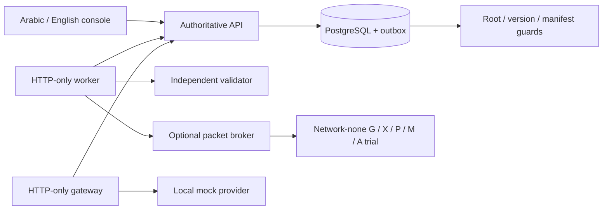

# Submitted poster to executable evidence

The submitted poster describes a proposed design and labels its 16-subset result illustrative. The implementation below does not retroactively turn that poster into a completed field study. This page tracks the concrete capabilities of release 0.2.

| Poster capability | Executable implementation | Evidence / practical limit |
|---|---|---|
| Preserve critical monitoring and alerting while containing an attack | `planner.py`, independent `validator.py`/`validator_service.py`, plans/apply APIs | 16-subset oracle; packet trial denies direct and relay paths while checking every synthetic monitoring/alert sample |
| Minimum function-safe containment | Bounded exhaustive ranking over declared hypotheses and enforceable denies | OPTIMAL only in the declared finite model; four outcomes; missing evidence stays UNKNOWN |
| Validate before actuation | Separate validator process, API recheck, plan/snapshot hashes; signed packet receipts | Unsafe/stale/mutated models rejected; only mapped G/X/P/M/A packet topology supported |
| Enforce and probe | `pep_service.py`, isolated `lab/` TCP/nftables trial | New and established flows measured; five events per function; temporary container ends after qualification, so this is not an always-on deployment |
| Control AI disclosure | `disclosure.py`, versioned YAML, exact approval, gateway | Four decisions, contact sanitization/reinspection, preserved roots; bounded Arabic/English corpus; external provider remains mock |
| Revoke a source and its descendants | General artifacts/edges/root closure, sealed stage inputs, atomic barrier/outbox, current-root guards | New reads and late publication denied; source bytes are retained for the lab record behind guards, not physically erased from all media |
| Preserve independent outputs and hold uncertain ones | Complete lineage or HELD; proven impact and precaution lists | T3 remains readable, C-D held; no inferred independence from similar text |
| Recover from an independent approved alternative | New run with replacement target, disjoint active roots, STAGED promotion, deterministic mock-quality check | New T2b identity; no reactivation of S1; no claim of LLM semantic equivalence |
| Survive interruption | Transactional outbox, leases, fencing, immutable outputs, idempotent completion | Actual worker kill/restart test; duplicate completion rejected/deduplicated; admitted unknown sends are never blindly retried |
| Inspect and reproduce results | Console, state export, raw reports, vault, pinned dependencies/images | 300 model settings, packet and restore evidence; another teammate's independent reproduction still pending |

## Remaining engineering-guide work

Institutional identity/TLS; separate deployment-level network permissions that prevent worker external egress; general function-owner roles and AND/OR dependency management; real device source attribution/capture windows; production object storage and retention; automatic off-host trusted-ledger replication and freshness admission; long-running PEP reconciliation/controller failure drills; additional topologies and failure injection; automated browser suite; independent human review and teammate reproduction.

These are tracked separately from the ready computer-lab demonstration. A successful lab trial is not a certification or an assurance about every real IoT deployment. The source contains a broader implementation than the original 0.1 fixture, but every qualification remains limited to the recorded environment and inputs.

Implementation foundations: [PostgreSQL locking](https://www.postgresql.org/docs/17/explicit-locking.html), [SQLAlchemy transactions](https://docs.sqlalchemy.org/en/20/core/connections.html), [Alembic migrations](https://alembic.sqlalchemy.org/en/latest/tutorial.html). These references explain primitives; WITHAQ's tests establish the application protocol within the stated lab scope.
